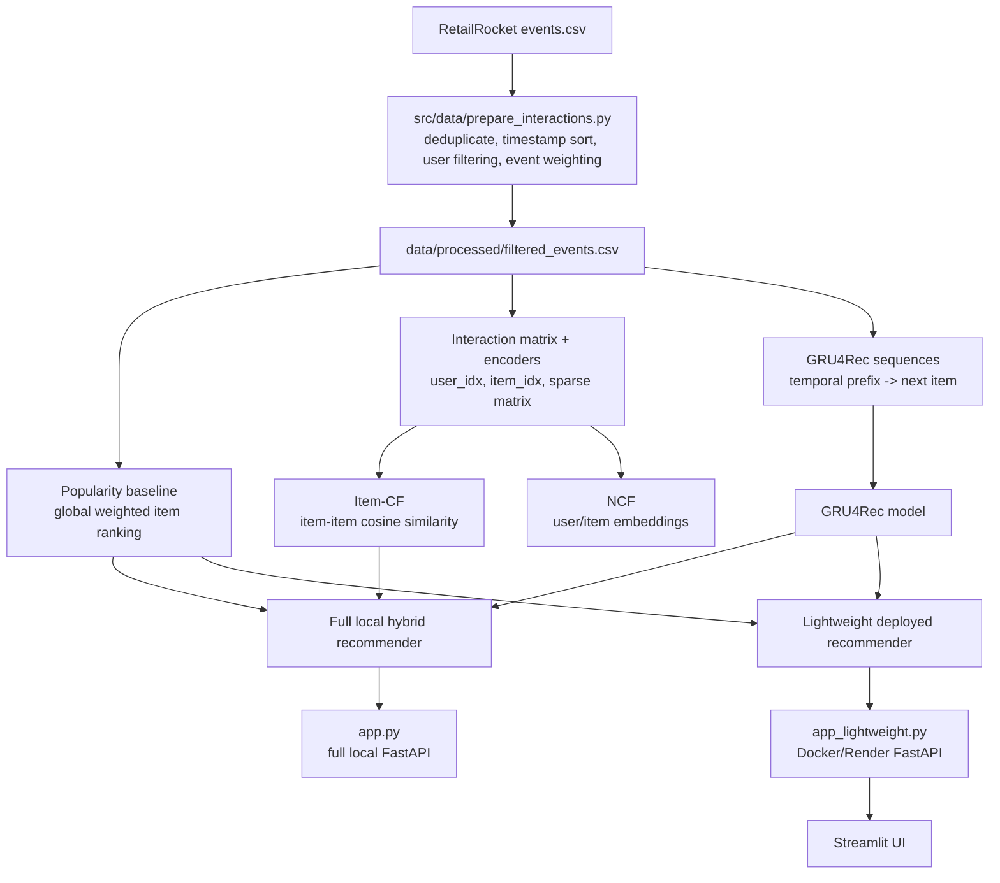

# Hybrid E-commerce Recommendation System

A production-style e-commerce recommendation system built from RetailRocket user behavior data. The project covers data preprocessing, popularity recommendations, item-item collaborative filtering, Neural Collaborative Filtering, GRU4Rec sequential recommendation, hybrid inference, FastAPI serving, Streamlit UI, Docker, and Render deployment.

The deployed production version intentionally uses a lightweight architecture: **GRU4Rec + popularity fallback**. The full local workflow also supports Item-CF and NCF, but the large Item-CF similarity artifact is kept out of deployment to keep the Docker image practical.

---

## Live Deployment

FastAPI backend:
https://ecommerce-recommender-api-slg9.onrender.com

Streamlit frontend:
https://ecommerce-recommender-ui.onrender.com

---

## What This Project Shows

- End-to-end recommendation system workflow from raw events to deployed app.
- Data cleaning, event weighting, user filtering, and sequence generation.
- Multiple recommender approaches: popularity, Item-CF, NCF, GRU4Rec, and hybrid.
- Experiment-oriented scripts for training and evaluation.
- Production tradeoff: full local hybrid model vs lightweight deployable API.
- FastAPI backend, Streamlit frontend, Docker packaging, and Render deployment.

---

## Dataset

Dataset: RetailRocket E-commerce Dataset

Main file used:

- `events.csv`

Metadata files kept for future content/category work:

- `item_properties_part1.csv`
- `item_properties_part2.csv`
- `category_tree.csv`

The main pipeline uses `events.csv` because it contains the behavior signals needed for recommendation:

- `visitorid`
- `itemid`
- `event`
- `timestamp`

The raw dataset is not committed to GitHub. Place it locally at:

```text
data/raw/events.csv
```

---

## Architecture



```text
Raw RetailRocket events
        |
        v
src/data/prepare_interactions.py
        |
        v
data/processed/filtered_events.csv
        |
        +--> Popularity baseline
        +--> Interaction matrix + encoders
        +--> Item-CF similarity model
        +--> NCF training data/model
        +--> GRU4Rec sequence data/model
        |
        v
Hybrid local recommender
        |
        v
Lightweight deployed recommender
        |
        v
FastAPI API + Streamlit UI
```

---

## Current Project Snapshot

These values are from the latest local rebuild of the current workflow. Raw and processed data are intentionally not pushed to GitHub.

| Area | Current value |
| --- | --- |
| Raw events | 2,756,101 rows, 1,407,580 users, 235,061 items |
| Filtered interactions | 948,077 rows, 81,590 users, 103,862 items |
| Event weights | view = 1, addtocart = 3, transaction = 5 |
| Interaction matrix | 81,590 users x 103,862 items |
| GRU4Rec split | 784,897 train rows, 81,590 temporal test rows |
| NCF split | 870,870 train rows, 77,207 temporal test rows |
| Deployment artifacts | `deploy_models/gru4rec_model.pth`, `deploy_models/popularity_baseline.pkl` |
| Latest verification | `14` unit tests passed, syntax check passed, both FastAPI apps returned HTTP 200 |

### Evaluation Snapshot

**Baseline comparison (full-pipeline run, logged via MLflow):**

| Model | HitRate@10 | Notes |
| --- | --- | --- |
| Popularity baseline | 0.00026 | Global weighted popularity ranking |
| GRU4Rec | 0.019 | ~73x lift over the popularity baseline; 1,000 sampled test rows |

On a catalog of 100K+ items, raw HitRate values are naturally small. Lift over a popularity baseline is the more meaningful signal here, since it shows the model is learning sequential behavior rather than defaulting to trending items.

**Current deployment artifact (smoke check):**

| Model / path | Metric | Notes |
| --- | --- | --- |
| GRU4Rec | HitRate@10 = 0.001 on 1,000 sampled test rows | Local smoke check using the current deployment checkpoint and regenerated temporal split |
| Hybrid lightweight | HitRate@10 = 0.001 on 1,000 sampled test rows | Uses GRU4Rec first and popularity fallback; Item-CF is not loaded in lightweight deployment |
| NCF | `test_mse` and `HitRate@K` | Available after running `python -m src.models.train_ncf`; split is temporal leave-one-out |
| Item-CF | `HitRate@K` | Available after running `python -m src.models.train_item_cf --top-k 100` |

The sampled HitRate values above are smoke checks for the current artifact path, not a final leaderboard claim. The important portfolio point is the evaluation method: temporal leave-one-out splits and top-K ranking metrics.

**Known gap:** the current deployment checkpoint (0.001) underperforms the earlier full-pipeline GRU4Rec run above (0.019). This is because the default training config in `train_gru4rec.py` (`sample_size=100000`, `epochs=1`) is a fast/lightweight setting, not a fully tuned run. Closing this gap by retraining on the full dataset with more epochs is listed under Future Improvements.

**Note on an early Item-CF diagnostic:** initial experimentation recorded an Item-CF HitRate@10 of 0.30, but on a diagnostic sample of only 10 evaluation users. That sample size is too small to be statistically meaningful, so it was not carried forward as a project benchmark.

---

## Recommendation Models

### 1. Popularity Baseline

Ranks items by total weighted interaction strength.

Files:

- `src/models/popularity_recommender.py`
- `src/models/train_baseline.py`

Purpose:

- Baseline model
- Cold-start and fallback recommendations

### 2. Item-Based Collaborative Filtering

Builds item-item similarity using cosine similarity over the item-user interaction matrix.

Files:

- `src/features/build_interaction_matrix.py`
- `src/models/train_item_cf.py`
- `src/models/recommend_item_cf.py`
- `src/models/evaluate_item_cf.py`

Deployment note:

The full Item-CF similarity matrix can become very large, so it is used for local hybrid evaluation but not included in the lightweight Render deployment.

### 3. Neural Collaborative Filtering

Learns user and item embeddings with a PyTorch neural network for implicit feedback prediction.

Files:

- `src/data/prepare_ncf_data.py`
- `src/models/train_ncf.py`
- `src/models/evaluate_ncf.py`

### 4. GRU4Rec Sequential Recommendation

Learns next-item recommendations from ordered user item sequences.

Files:

- `src/data/prepare_gru4rec_data.py`
- `src/models/train_gru4rec.py`
- `src/models/evaluate_gru4rec.py`
- `src/models/lightweight_recommender.py`

### 5. Hybrid Recommendation

Local hybrid inference combines:

- GRU4Rec predictions
- optional Item-CF recommendations if local artifacts exist
- popularity fallback

File:

- `src/models/hybrid_recommender.py`

Deployment inference uses:

- GRU4Rec
- popularity fallback

This keeps the production API small enough for cloud deployment.

---

## Project Structure

```text
.
|-- app.py
|-- app_lightweight.py
|-- streamlit_app.py
|-- Dockerfile.api
|-- Dockerfile.streamlit
|-- requirements-dev.txt
|-- requirements-docker.txt
|-- deploy_models/
|   |-- gru4rec_model.pth
|   `-- popularity_baseline.pkl
|-- notebooks/
|   `-- 01_data_understanding.ipynb
|-- src/
|   |-- api/
|   |-- data/
|   |-- evaluation/
|   |-- features/
|   `-- models/
`-- tests/
```

---

## Setup

Create and activate a virtual environment:

```bash
python -m venv rsmenv

# Windows
rsmenv\Scripts\activate

# Linux / Mac
source rsmenv/bin/activate
```

Install local development dependencies:

```bash
pip install -r requirements-dev.txt
```

The local development file includes the full training, evaluation, API, UI, and MLflow workflow.

For Docker/Render runtime dependencies, use:

```bash
pip install -r requirements-docker.txt
```

Dockerfiles already use `requirements-docker.txt`, so the deployment image stays smaller and does not install MLflow.

---

## Data Pipeline

Prepare cleaned interactions:

```bash
python -m src.data.prepare_interactions
```

Build interaction matrix and encoders:

```bash
python -m src.features.build_interaction_matrix
```

Create GRU4Rec train/test sequence data:

```bash
python -m src.data.prepare_gru4rec_data
```

Create NCF temporal train/test data:

```bash
python -m src.data.prepare_ncf_data
```

---

## Training

Train popularity baseline:

```bash
python -m src.models.train_baseline
```

Train Item-CF:

```bash
python -m src.models.train_item_cf
```

Train NCF:

```bash
python -m src.models.train_ncf
```

Train GRU4Rec:

```bash
python -m src.models.train_gru4rec
```

To also copy a GRU4Rec checkpoint into the deployment artifact folder:

```bash
python -m src.models.train_gru4rec --deploy-copy
```

---

## Evaluation

```bash
python -m src.models.evaluate_item_cf
python -m src.models.evaluate_ncf
python -m src.models.evaluate_gru4rec
python -m src.models.evaluate_hybrid
python -m src.evaluation.compare_runs
```

NCF evaluation reports both prediction error (`test_mse`) and ranking quality (`HitRate@K`) using the temporal leave-one-out test split.

---

## API

### Lightweight deployment API

This is the API used by Docker/Render:

```bash
uvicorn app_lightweight:app --reload
```

### Full local hybrid API

This API uses local hybrid logic and optional Item-CF artifacts:

```bash
uvicorn app:app --reload
```

### Endpoints

```text
GET  /
GET  /health
POST /recommend
GET  /recommend/popular
```

Example request:

```json
{
  "item_sequence": [325215, 259884, 216305],
  "top_n": 10
}
```

---

## Streamlit Frontend

Run locally:

```bash
streamlit run streamlit_app.py
```

The frontend reads the backend URL from `API_URL`:

```bash
set API_URL=http://127.0.0.1:8000
streamlit run streamlit_app.py
```

---

## Docker

Build API image:

```bash
docker build -f Dockerfile.api -t ecommerce-recommender-api .
```

Run API:

```bash
docker run -p 8000:8000 ecommerce-recommender-api
```

Build Streamlit image:

```bash
docker build -f Dockerfile.streamlit -t ecommerce-recommender-ui .
```

---

## Tests

Run tests:

```bash
python -m unittest discover -s tests -v
```

Run syntax check:

```bash
python -m compileall -q app.py app_lightweight.py streamlit_app.py src tests
```

---

## Deployment Optimization

The full hybrid system works locally, but the full Item-CF similarity matrix is too large for simple cloud deployment. The deployed Render API therefore uses:

- GRU4Rec checkpoint from `deploy_models/gru4rec_model.pth`
- popularity fallback from `deploy_models/popularity_baseline.pkl`
- CPU-only PyTorch
- lightweight FastAPI container

This is the intended production tradeoff: keep the full modeling workflow in the repo, but deploy a smaller, reliable inference path.

---

## Future Improvements

- Retrain GRU4Rec on the full training set with more epochs (current deployment checkpoint uses a fast `sample_size=100000`, `epochs=1` config) to close the gap with the earlier full-pipeline run (HitRate@10 0.019).
- Content-based recommendation using item metadata.
- Category-aware recommendation using `category_tree.csv`.
- Approximate nearest neighbor search for Item-CF/hybrid retrieval.
- Top-k similarity cache for faster hybrid evaluation.
- Redis caching for repeated API requests.
- Better ranking metrics such as Recall@K, NDCG@K, and MRR.

---

## Author

Suman Behera

GitHub:
https://github.com/sumanbehera-ds